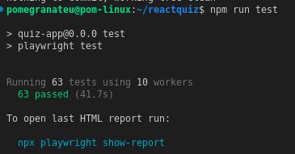
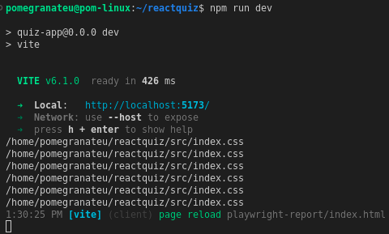
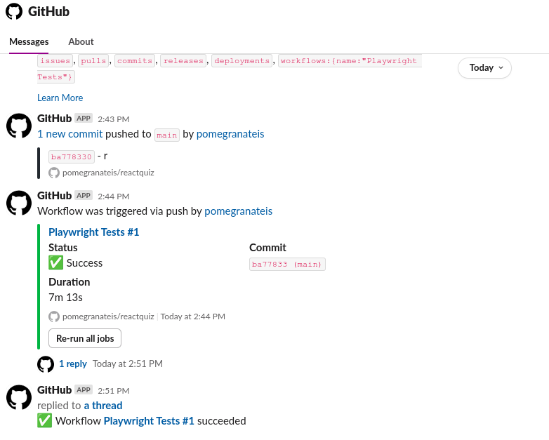

# Part 1 - Test Implementation Summary

This document summarizes the automated test implementation for the Kahoot Clone project.

**Repository Link:** [reactquiz](https://github.com/pomegranateis/reactquiz)

## Test Files Created

1. **quiz-flow.spec.ts** - Core quiz functionality (TC001-TC005)
2. **timer.spec.ts** - Timer behavior tests (TC006-TC007)
3. **game-state.spec.ts** - Game state management (TC008-TC009)
4. **ui-ux.spec.ts** - User interface and experience (TC010-TC011)
5. **edge-cases.spec.ts** - Edge case scenarios (TC012-TC013)
6. **data-validation.spec.ts** - Data integrity tests (TC014-TC015)

## Test Data Attributes Added

The following `data-testid` attributes were added to components for reliable test targeting:

- `question-card` - Main question container
- `question-counter` - Current question number display
- `question-text` - Question content
- `answer-option` - Answer choice buttons
- `feedback` - Correct/incorrect feedback message
- `timer` - Timer display
- `score` - Current score display
- `game-over` - Game over screen
- `final-score` - Final score display
- `restart-button` - Play Again button

## How to Run Tests

1. Start the development server: `npm run dev`
2. In a separate terminal, run tests: `npm run test`
3. For interactive testing: `npm run test:ui`
4. For debugging: `npm run test:debug`

## Test Coverage

The tests validate all functional requirements from the README:

- Quiz initialization and start process
- Answer selection and feedback
- Score calculation (correct/incorrect answers)
- Timer countdown and automatic quiz end
- Question navigation and completion
- Game restart functionality
- Responsive design validation
- Edge case handling (rapid clicks, browser refresh)
- Data integrity (question format, score accuracy)

## Notes

- Tests assume the development server runs on `http://localhost:5173`
- Visual feedback tests check for CSS classes indicating selected/correct states
- Timer tests include tolerance for timing variations
- All tests include proper cleanup and state reset between runs

# Part 2 - GitHub Actions Integration with Slack Notifications

## Continuous Integration Setup

To enhance automation and team collaboration, I integrated GitHub Actions into the Kahoot Clone project. A dedicated workflow file (.`github/workflows/playwright.yml`) was created to automatically run Playwright tests on every push or pull request to the `main` and `master` branches.

The workflow was designed with the following steps:

1. **Checkout Source Code** – Uses `actions/checkout@v4` to pull the repository code into the runner.

2. **Setup Node.js** – Configures Node.js version 20 using `actions/setup-node@v4`.

3. **Install Dependencies** – Runs `npm ci` for a clean, reproducible dependency installation.

4. **Install Playwright Browsers** – Executes `npx playwright install --with-deps` to set up required browsers.

5. **Build Application** – Ensures the app compiles successfully using `npm run build`.

6. **Start Dev Server** – Runs `npm run dev &` in the background to serve the application.

7. **Wait for Server** – Adds a short delay (`sleep 5`) before running tests to guarantee server readiness.

8. **Execute Playwright Tests** – Runs `npx playwright test` for automated UI and end-to-end testing.

9. **Upload Test Reports** – Stores Playwright reports as artifacts using `actions/upload-artifact@v4` with a retention period of 30 days.

This automation ensures that every code update is verified through consistent test execution, reducing the chance of regressions.

## Slack Integration for Push Notifications

To improve collaboration and real-time feedback, I connected the repository with Slack using the GitHub Slack App. This allowed test results and workflow activity to be instantly posted in the team’s Slack channel.

The integration provides:

* **Push Notifications** – Every commit or pull request triggers an automated Slack message showing the commit details.

* **Workflow Status Updates** – Playwright test workflows post live updates (queued, running, success, or failure).

* **Detailed Test Reports** – Slack links back to GitHub workflow logs and artifacts, ensuring quick access to debugging information.

* **Real-Time Collaboration** – Team members are immediately informed of test outcomes, enabling faster responses to issues.

Example Slack notifications included:

* A new commit pushed to `main` automatically triggered Playwright tests.

* Slack displayed the test status (`Queued`, `Running`, `Success`), along with commit details.

* A successful Playwright test run was confirmed in Slack with duration and results.

## Outcome and Benefits

* Automated testing ensures code quality without manual intervention.

* Slack notifications provide transparency and keep all contributors updated.

* The setup reduces communication delays by bringing GitHub workflows directly into the team’s workspace.

* Playwright reports are stored for later inspection, supporting traceability.

Overall, this integration transformed the testing process into a **continuous**, **collaborative workflow**, aligning with modern DevOps practices.