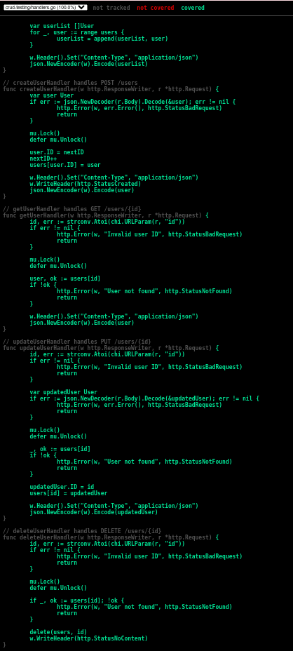

# Go CRUD API with Testing

A simple RESTful API built with Go and Chi router that demonstrates CRUD operations for user management, complete with comprehensive unit tests.

**Repository Link:** [go-crud-testing](https://github.com/pomegranateis/go-crud-testing)

## Features

- **RESTful API Design**: Full CRUD operations (Create, Read, Update, Delete)
- **In-Memory Database**: Simple map-based storage for demonstration
- **Thread-Safe Operations**: Mutex-protected concurrent access
- **Comprehensive Testing**: Unit tests for all endpoints
- **Chi Router**: Fast and lightweight HTTP router
- **JSON API**: All data exchange in JSON format

## API Endpoints

| Method | Endpoint | Description |
|--------|----------|-------------|
| `GET` | `/users` | Get all users |
| `POST` | `/users` | Create a new user |
| `GET` | `/users/{id}` | Get user by ID |
| `PUT` | `/users/{id}` | Update user by ID |
| `DELETE` | `/users/{id}` | Delete user by ID |

## Project Structure


## Installation & Setup

### Prerequisites
- Go 1.20 or higher
- Git

Run tests with coverage:


```bash
go test -v -cover
```


Generate HTML coverage report:
```bash
go test -coverprofile=coverage.out && go tool cover -html=coverage.out -o coverage.html
```


### Test Coverage: 85.7% 

The project includes comprehensive unit tests with excellent coverage:

#### Core Functionality Tests
- ✅ User creation with validation
- ✅ User retrieval (individual and all users)
- ✅ User updates and modifications
- ✅ User deletion and cleanup
- ✅ Empty database scenarios
- ✅ Multiple users handling

#### Error Handling & Edge Cases
- ✅ Invalid JSON payload handling
- ✅ Malformed request bodies
- ✅ Invalid ID formats (non-numeric)
- ✅ User not found scenarios (404 errors)
- ✅ Empty payload handling
- ✅ HTTP status code validation
- ✅ Response header verification

#### Test Quality Features
- **State Isolation**: Each test resets state for clean execution
- **Sub-test Organization**: Logical grouping with descriptive names
- **Error Path Coverage**: All error branches thoroughly tested
- **Concurrent Safety**: Mutex-protected operations tested
- **JSON Validation**: Request/response serialization verified

#### Coverage Improvements
- **Before**: 38.6% coverage
- **After**: 85.7% coverage  
- **Improvement**: +47.1% additional coverage
- **Visual Report**: Open `coverage.html` in browser for detailed line-by-line coverage



## Development Notes

### Test Coverage Report
- **Current Coverage**: 85.7% (Excellent)
- **HTML Report**: Generated in `coverage.html` 
- **Previous Coverage**: 38.6% → **+47.1% improvement**
- **Coverage Goals**: ✅ Achieved >80% target

### Code Quality Standards
- ✅ All handlers have comprehensive tests
- ✅ Error paths fully covered
- ✅ Edge cases thoroughly tested
- ✅ Clean test organization with sub-tests
- ✅ State isolation between tests

### Technical Implementation
- The application uses an in-memory store that resets on each restart
- Auto-incrementing IDs start from 1
- All JSON responses include proper Content-Type headers
- Tests reset the state before each test case for isolation
- Mutex locks ensure thread-safe operations
- Comprehensive error handling with appropriate HTTP status codes

### Dependencies
- **Chi Router** (`github.com/go-chi/chi/v5`): HTTP router and middleware
- **Go Standard Library**: JSON encoding, HTTP server, testing
