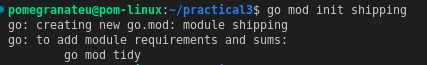
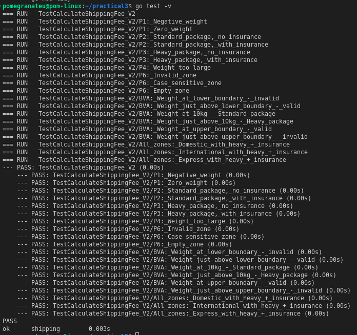

# Software Testing Practical 3: Advanced Shipping Fee Calculator

**Repository Link:** [black-box-testing](https://github.com/pomegranateis/black-box-testing)

## Overview
This project demonstrates specification-based testing techniques including Equivalence Partitioning and Boundary Value Analysis on an updated shipping fee calculation system.

## Function Under Test
`CalculateShippingFee(weight float64, zone string, insured bool) (float64, error)`

## Equivalence Partitioning Analysis

### Weight Input Partitions

**P1: Invalid - Too Small (weight ≤ 0)**
- **Rationale**: The specification states weight must be greater than 0
- **Examples**: -5, 0, -10.5
- **Expected Behavior**: Return error "invalid weight"
- **Why this partition**: Any weight ≤ 0 violates the business rule and should be handled identically

**P2: Valid - Standard Package (0 < weight ≤ 10)**  
- **Rationale**: Weights in this range are classified as "Standard" packages
- **Examples**: 1, 5.5, 10
- **Expected Behavior**: Base fee only, no heavy surcharge
- **Why this partition**: All weights in this range follow the same calculation rules

**P3: Valid - Heavy Package (10 < weight ≤ 50)**
- **Rationale**: Weights in this range are classified as "Heavy" packages  
- **Examples**: 10.1, 25, 50
- **Expected Behavior**: Base fee + $7.50 heavy surcharge
- **Why this partition**: All weights in this range trigger the heavy surcharge

**P4: Invalid - Too Large (weight > 50)**
- **Rationale**: The specification limits weight to maximum 50kg
- **Examples**: 50.1, 100, 75.5  
- **Expected Behavior**: Return error "invalid weight"
- **Why this partition**: Any weight > 50 violates the business rule

### Zone Input Partitions

**P5: Valid Zones**
- **Values**: "Domestic", "International", "Express"
- **Rationale**: These are the only three zones explicitly allowed by the specification
- **Expected Behavior**: Apply corresponding base fees ($5, $20, $30)
- **Why this partition**: Each valid zone has a defined base fee

**P6: Invalid Zones**  
- **Examples**: "Local", "domestic" (case-sensitive), "", "unknown"
- **Rationale**: Any zone not in the valid list should be rejected
- **Expected Behavior**: Return error "invalid zone"
- **Why this partition**: All invalid zones should be handled the same way

### Insurance Input Partitions

**P7: Insurance Requested (insured = true)**
- **Expected Behavior**: Add 1.5% of (base fee + heavy surcharge) to total
- **Why this partition**: When insurance is requested, additional cost is calculated

**P8: No Insurance (insured = false)**
- **Expected Behavior**: No insurance cost added
- **Why this partition**: When insurance is not requested, no additional cost

## Boundary Value Analysis

### Weight Boundaries Identified

**Lower Boundary (around 0):**
- **0**: Last invalid value - should return error
- **0.1**: First valid value - should calculate as Standard package
- **Rationale**: This boundary tests the transition from invalid to valid input

**Mid Boundary (around 10):**  
- **10**: Last value for Standard package (no surcharge)
- **10.1**: First value for Heavy package (+$7.50 surcharge)  
- **Rationale**: This boundary tests the critical transition where surcharge is applied

**Upper Boundary (around 50):**
- **50**: Last valid value (Heavy package with surcharge)
- **50.1**: First invalid value - should return error
- **Rationale**: This boundary tests the transition from valid to invalid input

### Why These Boundaries Matter

1. **0 boundary**: Critical for input validation - separates invalid from valid weights
2. **10 boundary**: Business logic boundary - determines surcharge application
3. **50 boundary**: Critical for input validation - separates valid from invalid weights

Boundary testing is crucial because off-by-one errors are common. For example, a developer might incorrectly implement `weight >= 10` instead of `weight > 10` for the heavy surcharge condition.

## Test Strategy

### Coverage Approach
Our test suite covers:
- **All identified partitions**: Each partition has representative test cases
- **All critical boundaries**: Edge cases that commonly contain bugs  
- **Combination scenarios**: Different input combinations to ensure interactions work correctly
- **Error conditions**: Invalid inputs are properly handled

### Test Case Design Rationale

1. **Systematic Coverage**: Every partition and boundary identified in our analysis has corresponding test cases
2. **Representative Values**: Each test case uses values that clearly represent their partition
3. **Error Validation**: Invalid inputs are tested to ensure proper error handling
4. **Floating Point Precision**: Fee calculations use tolerance-based comparison due to floating point arithmetic
5. **Descriptive Names**: Test case names clearly indicate what scenario is being tested

## Expected Test Results

All test cases passed, demonstrating that:
- Input validation works correctly for weight and zone
- Fee calculations are accurate for all scenarios  
- Heavy surcharge is applied correctly based on weight
- Insurance calculation works properly
- Error messages are appropriate and informative

## Key Learning Outcomes

1. **Specification-Based Testing**: How to derive comprehensive tests from requirements without examining code
2. **Systematic Test Design**: Using formal techniques rather than ad-hoc testing
3. **Edge Case Identification**: Finding boundary conditions where bugs commonly occur
4. **Test Organization**: Structuring tests for maintainability and clarity