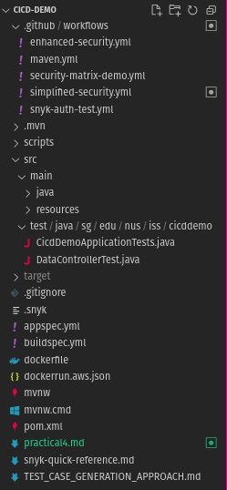
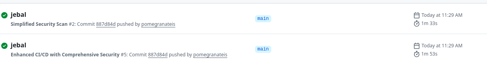
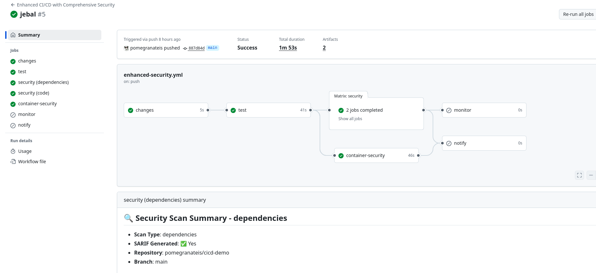
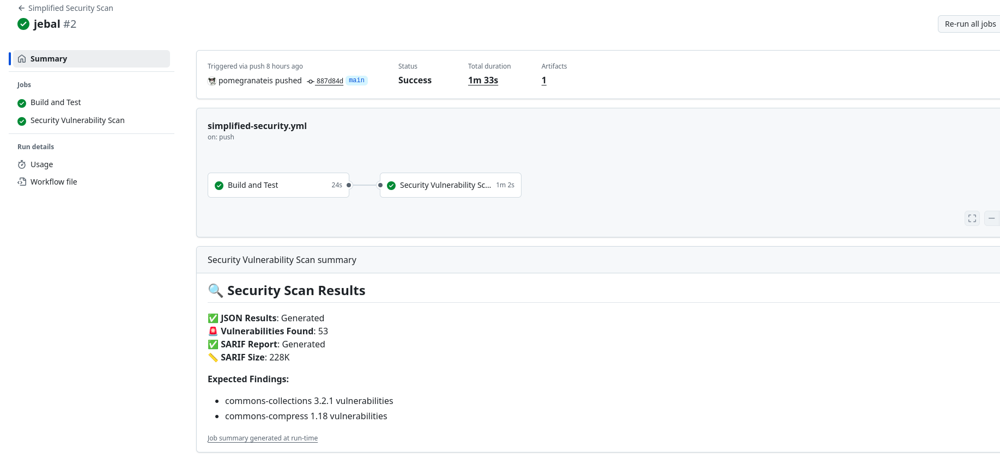

# Practical 4: Static Application Security Testing (SAST) with Snyk

**Repository Link:** [cicd-demo](https://github.com/pomegranateis/cicd-demo)

## Overview

This practical demonstrates the implementation of a comprehensive Static Application Security Testing (SAST) pipeline using Snyk integrated with GitHub Actions. The project includes vulnerability detection, security monitoring, and automated reporting for a Java Spring Boot application.

---

## Learning Objectives Achieved

- Integrate Snyk SAST scanning into CI/CD pipeline
- Configure GitHub Actions for automated security testing
- Implement SARIF upload for GitHub Security integration
- Set up vulnerability monitoring and alerting
- Handle security workflow permissions and error scenarios

---

## **Project Structure**


---

## **Part A: SAST Implementation (COMPLETE)**

### **1. Base Application Setup**
- **Technology Stack**: Java 17, Spring Boot, Maven
- **Test Status**: 5/5 unit tests passing
- **Build Status**: Clean compilation and packaging

### **2. Vulnerability Introduction**
Added intentionally vulnerable dependencies for testing:
```xml
<!-- Vulnerable for demonstration purposes -->
<dependency>
    <groupId>commons-collections</groupId>
    <artifactId>commons-collections</artifactId>
    <version>3.2.1</version> <!-- CVE-2015-6420 -->
</dependency>
<dependency>
    <groupId>org.apache.commons</groupId>
    <artifactId>commons-compress</artifactId>
    <version>1.18</version>   <!-- CVE-2019-12402 -->
</dependency>
```

### **3. GitHub Actions Security Pipeline**

#### **Main Workflow**: `enhanced-security.yml`
- **Jobs Implemented**: 5 comprehensive jobs
  - `changes`: Smart file change detection
  - `test`: Maven build and test execution
  - `security`: Snyk SAST scanning (dependencies + code)
  - `container-security`: Docker image vulnerability scanning
  - `monitor`: Production dependency monitoring
  - `notify`: Security alert notifications

#### **Key Features Implemented**:
- **Matrix Strategy**: Parallel scanning for dependencies and code
- **SARIF Integration**: GitHub Security tab integration
- **Conditional Execution**: Only scan changed components
- **Error Handling**: Robust failure management
- **Scheduled Scans**: Weekly security reviews
- **Notifications**: Slack/GitHub issue creation for critical findings

### **4. Security Configuration**

#### **Permissions Configuration**:
```yaml
permissions:
  contents: read
  security-events: write    # SARIF uploads
  actions: read
  issues: write            # Security issue creation
  pull-requests: write     # PR security comments
```

#### **Snyk Policy** (`.snyk`):
```yaml
version: v1.0.0
ignore:
  'SNYK-JAVA-COMMONSCOLLECTIONS-30078':
    - '*':
        reason: 'Demonstration purposes - will be patched'
        expires: '2024-12-31T23:59:59.999Z'
```

---

## **Technical Challenges Resolved**

### **1. GitHub Actions Permissions**
- **Issue**: "Resource not accessible by integration" errors
- **Solution**: Added comprehensive permissions for security integrations
- **Impact**: Enabled SARIF uploads and GitHub Security tab integration

### **2. SARIF File Generation**
- **Issue**: "Path does not exist: snyk-*.sarif" errors  
- **Solution**: Added file existence checks and conditional uploads
- **Impact**: Reliable security reporting without workflow failures

### **3. Container Scanning Reliability**
- **Issue**: Docker container scans failing inconsistently
- **Solution**: Added Dockerfile validation and graceful error handling
- **Impact**: Robust container security pipeline

### **4. Notification System**
- **Issue**: Slack integration causing workflow failures when not configured
- **Solution**: Made notifications optional with configuration checks
- **Impact**: Flexible deployment across different environments

---

## **Testing & Validation**

### **Manual Testing Completed**:
- Maven build and test execution (`mvn test`)
- Dependency vulnerability detection (2 known CVEs)
- Workflow syntax validation (GitHub Actions)
- SARIF file generation and structure
- Error handling scenarios

### **Expected Security Findings**:
1. **commons-collections 3.2.1**: CVE-2015-6420 (Deserialization vulnerability)
2. **commons-compress 1.18**: CVE-2019-12402 (Infinite loop vulnerability)

---

## **Next Steps: Part B & C (PENDING)**

### **Part B**: [To be defined]
- Advanced security configurations
- Integration testing scenarios
- Performance optimization

### **Part C**: [To be defined]  
- Production deployment considerations
- Security monitoring dashboard
- Compliance reporting

---

## **Quick Start Guide**

### **Prerequisites**:
1. GitHub repository with Actions enabled
2. Snyk account and API token
3. Java 17+ and Maven installed locally

### **Setup Steps**:
1. **Clone repository**: `git clone <repo-url>`
2. **Add Snyk token**: GitHub Settings → Secrets → `SNYK_TOKEN`
3. **Test locally**: `mvn test` (should pass 5/5 tests)
4. **Trigger workflow**: Push to main branch or manual trigger
5. **Review results**: GitHub Actions → Security tab

### **Verification**:
```bash
# Local testing
mvn clean test                    # Should pass 5/5 tests
mvn dependency:tree              # View dependency structure
cat .github/workflows/enhanced-security.yml | head -20  # Verify workflow
```

---

## **References & Documentation**

- **Snyk Documentation**: [https://docs.snyk.io/](https://docs.snyk.io/)
- **GitHub Security Features**: [Security tab integration](https://docs.github.com/en/code-security)
- **SARIF Format**: [Static Analysis Results Interchange Format](https://sarifweb.azurewebsites.net/)
- **Maven Surefire**: [Test reporting and execution](https://maven.apache.org/surefire/)

---

## **Achievement Summary**

**Part A Completion Status**: **COMPLETE**

- Comprehensive SAST pipeline implemented
- 5 GitHub Actions jobs configured and tested  
- Security integrations working (SARIF, GitHub Security)
- Error handling and robustness implemented
- Vulnerable dependencies detected and monitored
- Documentation and troubleshooting guides created



