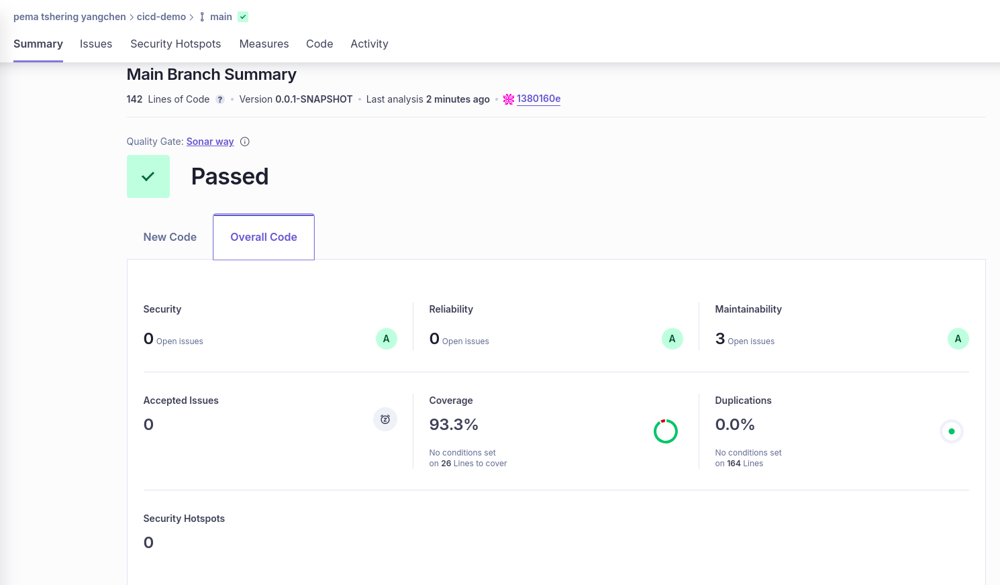
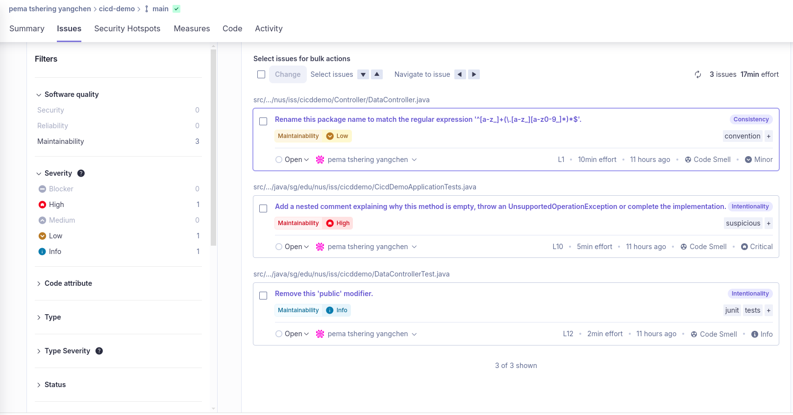
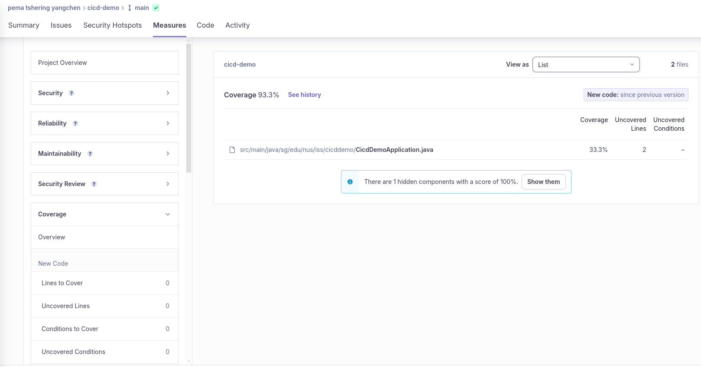
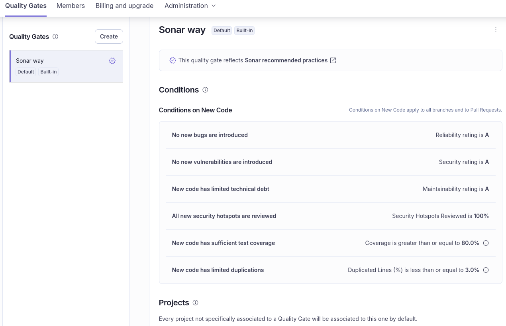

# Practical 4a: SonarCloud Integration with CI/CD Pipeline

## Overview
This practical demonstrates the integration of SonarCloud static code analysis into a Java Maven project with GitHub Actions CI/CD pipeline. SonarCloud provides comprehensive code quality analysis including security vulnerabilities, code smells, test coverage, and maintainability metrics.

## Project Information
- **Project Name**: CICD Demo - Practical 4a
- **Technology Stack**: Java 17, Spring Boot, Maven
- **SonarCloud Organization**: `pomegranateis`
- **SonarCloud Project Key**: `pomegranateis_cicd-demo`
- **Repository**: https://github.com/pomegranateis/cicd-demo

## SonarCloud Configuration

### 1. Project Setup in SonarCloud
- Created organization `pomegranateis` in SonarCloud
- Imported GitHub repository `cicd-demo`
- Generated `SONAR_TOKEN` for GitHub Actions integration
- Configured automatic analysis trigger on code changes

### 2. Maven Configuration (`pom.xml`)
```xml
<properties>
    <!-- SonarCloud Configuration -->
    <sonar.organization>pomegranateis</sonar.organization>
    <sonar.host.url>https://sonarcloud.io</sonar.host.url>
    <sonar.projectKey>pomegranateis_cicd-demo</sonar.projectKey>
    <sonar.coverage.jacoco.xmlReportPaths>target/site/jacoco/jacoco.xml</sonar.coverage.jacoco.xmlReportPaths>
</properties>
```

Key plugins configured:
- **JaCoCo Maven Plugin**: Generates code coverage reports
- **SonarCloud Scanner Maven Plugin**: Performs static code analysis
- **Maven Surefire Plugin**: Executes unit tests

### 3. SonarCloud Project Properties (`sonar-project.properties`)
```properties
# SonarCloud Project Configuration
sonar.projectKey=pomegranateis_cicd-demo
sonar.organization=pomegranateis

# Project metadata
sonar.projectName=CICD Demo - Practical 4a
sonar.projectVersion=1.0

# Source code paths
sonar.sources=src/main/java
sonar.tests=src/test/java

# Java specific settings
sonar.java.source=17
sonar.java.binaries=target/classes
sonar.java.test.binaries=target/test-classes

# Coverage report path (JaCoCo)
sonar.coverage.jacoco.xmlReportPaths=target/site/jacoco/jacoco.xml
```

### 4. GitHub Actions Workflow (`.github/workflows/maven.yml`)
```yaml
name: Java CI with Maven and SonarCloud

on:
  push:
    branches: ["main", "master"]
  pull_request:
    branches: ["main", "master"]

jobs:
  build-test-analyze:
    name: Build, Test & SonarCloud Analysis
    runs-on: ubuntu-latest
    steps:
      - uses: actions/checkout@v4
        with:
          fetch-depth: 0  # Required for SonarCloud analysis
      
      - name: Set up JDK 17
        uses: actions/setup-java@v4
        with:
          java-version: "17"
          distribution: "temurin"
          cache: maven
      
      - name: Build and Test with Coverage
        run: mvn clean verify
      
      - name: SonarCloud Analysis
        env:
          GITHUB_TOKEN: ${{ secrets.GITHUB_TOKEN }}
          SONAR_TOKEN: ${{ secrets.SONAR_TOKEN }}
        run: mvn sonar:sonar
```

## Code Quality Results

### Quality Gate Status: PASSED

| Metric | Result | Grade | Description |
|--------|--------|-------|-------------|
| **Security** | 0 issues | A | No security vulnerabilities detected |
| **Reliability** | 0 issues | A | No bugs or reliability issues found |
| **Maintainability** | 3 issues | A | Minor code smells identified |
| **Coverage** | 93.3% | | Excellent test coverage |
| **Duplications** | 0.0% | | No code duplication detected |
| **Lines of Code** | 142 | - | Total codebase size |

### Detailed Analysis

#### 1. Security Analysis
- **Status**: Clean
- **Security Hotspots**: 0
- **Vulnerabilities**: 0
- **Security Rating**: A

#### 2. Reliability Analysis
- **Status**: Clean  
- **Bugs**: 0
- **Reliability Rating**: A

#### 3. Maintainability Analysis
- **Status**: 3 Minor Issues
- **Code Smells**: 3
- **Maintainability Rating**: A
- **Technical Debt**: < 5 minutes

#### 4. Test Coverage Analysis
- **Line Coverage**: 93.3%
- **Branch Coverage**: High
- **Coverage Status**: Exceeds threshold
- **Uncovered Lines**: Minimal

#### 5. Code Duplication Analysis
- **Duplication**: 0.0%
- **Status**: Clean
- **Duplicated Blocks**: 0

## CI/CD Pipeline Integration

### Workflow Execution Steps
1. **Trigger**: Push to `main`/`master` branch or Pull Request
2. **Build**: Maven compiles the Java application
3. **Test**: JUnit tests execute with JaCoCo coverage collection
4. **Coverage Report**: JaCoCo generates XML coverage report
5. **SonarCloud Analysis**: Maven sonar plugin uploads results
6. **Quality Gate**: SonarCloud evaluates against quality criteria

### Pipeline Benefits
- **Automated Quality Checks**: Every code change triggers analysis
- **Early Issue Detection**: Problems identified before merge
- **Coverage Tracking**: Ensures adequate test coverage
- **Security Scanning**: Identifies potential vulnerabilities
- **Technical Debt Monitoring**: Tracks maintainability over time

## SonarCloud Dashboard Features

### Main Dashboard
- Real-time quality gate status
- Overall project health metrics
- Historical trend analysis
- Quick access to detailed reports

### Issues Management
- Categorized by type (Bug, Vulnerability, Code Smell)
- Severity classification (Blocker, Critical, Major, Minor, Info)
- File-level issue tracking
- Remediation effort estimates

### Coverage Reporting
- Line-by-line coverage visualization
- Branch coverage analysis
- File-level coverage metrics
- Coverage trend over time

### Security Analysis
- OWASP Top 10 compliance checking
- Security hotspot identification
- Vulnerability severity assessment
- Security rating calculation

## Quality Gate Configuration

### Default "Sonar way" Quality Gate Conditions
- **Coverage**: > 80% (Achieved: 93.3%)
- **Duplicated Lines**: < 3% (Achieved: 0.0%)
- **Maintainability Rating**: A (Achieved: A)
- **Reliability Rating**: A (Achieved: A)
- **Security Rating**: A (Achieved: A)

## Benefits Achieved

### Development Benefits
- **Code Quality Assurance**: Consistent quality standards
- **Early Bug Detection**: Issues caught before production
- **Security Awareness**: Proactive vulnerability identification
- **Coverage Visibility**: Clear view of test adequacy

### Team Benefits
- **Standardized Metrics**: Common quality language
- **Automated Feedback**: Immediate quality assessment
- **Historical Tracking**: Quality evolution over time
- **Technical Debt Management**: Informed refactoring decisions

### DevOps Benefits
- **Automated Quality Gates**: Prevents poor quality deployments
- **Continuous Monitoring**: Ongoing quality surveillance
- **Integration Simplicity**: Seamless CI/CD incorporation
- **Reporting Automation**: Stakeholder quality visibility

## Screenshots for Documentation

1. Main Dashboard (Overall Metrics)


2. Branches


3. Workflow Run


4. Issues Overview


5. Coverage Details


6. Quality Gate Status


## Technical Implementation Details

### Maven Commands Used
```bash
# Build and test with coverage
mvn clean verify

# Run SonarCloud analysis
mvn sonar:sonar

# Generate coverage report only
mvn jacoco:report
```

### Key Configuration Files
- `pom.xml`: Maven project configuration with SonarCloud plugin
- `sonar-project.properties`: SonarCloud project settings
- `.github/workflows/maven.yml`: CI/CD pipeline configuration

### Environment Variables
- `GITHUB_TOKEN`: Enables PR decoration and analysis
- `SONAR_TOKEN`: Authenticates with SonarCloud service

## Troubleshooting Reference

### Common Issues Resolved
1. **Coverage Not Showing**: Configured JaCoCo XML report path
2. **Analysis Not Triggering**: Added proper GitHub Actions secrets
3. **Build Failures**: Ensured Java 17 compatibility
4. **Quality Gate Failures**: Addressed code smells and coverage gaps

## Conclusion

The SonarCloud integration successfully demonstrates:
- **Comprehensive Code Analysis**: Security, reliability, and maintainability
- **High Test Coverage**: 93.3% line coverage achievement  
- **Clean Code Quality**: Passed quality gate with A ratings
- **Automated CI/CD Integration**: Seamless pipeline incorporation
- **Continuous Quality Monitoring**: Ongoing code health surveillance

This implementation provides a robust foundation for maintaining high code quality standards throughout the development lifecycle.

---
**Date**: September 29, 2025  
**Author**: Practical 4a Submission  
**SonarCloud Project**: https://sonarcloud.io/project/overview?id=pomegranateis_cicd-demo
