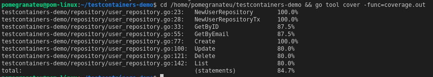
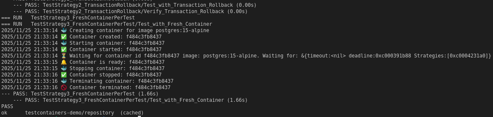
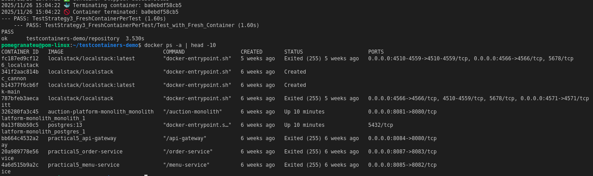
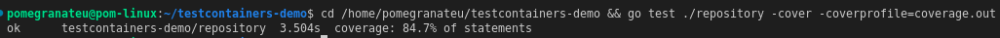

# Integration Testing with Testcontainers - Practical Report

**Repository Link:** [testcontainers-demo](https://github.com/pomegranateis/testcontainers-demo)

## Table of Contents
1. [Project Overview](#project-overview)
2. [Implementation Details](#implementation-details)
3. [Test Isolation Strategies](#test-isolation-strategies)
4. [Results and Evidence](#results-and-evidence)
5. [Benefits and Challenges](#benefits-and-challenges)
6. [Conclusion](#conclusion)

## Project Overview

### Objective
This practical demonstrates the implementation of integration testing using Testcontainers in Go, focusing on database operations and various test isolation strategies.

### Technology Stack
- **Language**: Go 1.21+
- **Database**: PostgreSQL 15 (Alpine)
- **Testing Framework**: Go's built-in testing package
- **Container Management**: Testcontainers for Go (v0.39.0)
- **Database Driver**: pq (PostgreSQL driver)

### Project Structure


*Figure 4: Complete project structure showing organized code layout*

```
testcontainers-demo/
├── go.mod                          # Go module definition
├── go.sum                          # Dependency checksums
├── coverage.out                    # Test coverage report
├── img/                            # Documentation screenshots
│   ├── 1.png                       # Test execution results
│   ├── 2.png                       # Code coverage report
│   ├── 3.png                       # Container management logs
│   └── 4.png                       # Project structure view
├── migrations/
│   └── init.sql                    # Database schema initialization
├── models/
│   └── user.go                     # User data model
└── repository/
    ├── user_repository.go          # User repository implementation
    └── user_repository_test.go     # Integration tests
```

## Implementation Details

### Database Model
The project implements a simple User model with the following structure:
```go
type User struct {
    ID    int    `json:"id"`
    Email string `json:"email"`
    Name  string `json:"name"`
}
```

### Repository Pattern
The `UserRepository` implements CRUD operations:
- `GetByID(id int)` - Retrieve user by ID
- `GetByEmail(email string)` - Retrieve user by email
- `Create(email, name string)` - Create new user
- `Update(user *User)` - Update existing user
- `Delete(id int)` - Delete user by ID
- `List()` - List all users

### Database Schema
```sql
CREATE TABLE IF NOT EXISTS users (
    id SERIAL PRIMARY KEY,
    email VARCHAR(255) UNIQUE NOT NULL,
    name VARCHAR(255) NOT NULL,
    created_at TIMESTAMP DEFAULT CURRENT_TIMESTAMP
);
```

## Test Isolation Strategies

### Strategy 1: Cleanup in Each Test
This strategy creates test data and ensures cleanup using `defer` statements:

```go
func TestStrategy1_CleanupInEachTest(t *testing.T) {
    t.Run("Create and Cleanup Test Data", func(t *testing.T) {
        user, err := repo.Create("cleanup@example.com", "Cleanup User")
        require.NoError(t, err)
        
        // Always cleanup, even if test fails
        defer func() {
            err := repo.Delete(user.ID)
            if err != nil {
                t.Logf("Failed to cleanup user: %v", err)
            }
        }()
        
        // Test operations...
    })
}
```

**Pros**: Simple to implement, explicit cleanup
**Cons**: Manual cleanup required, potential data leaks if cleanup fails

### Strategy 2: Transaction Rollback
This strategy uses database transactions that are automatically rolled back:

```go
func TestStrategy2_TransactionRollback(t *testing.T) {
    tx, err := testDB.Begin()
    require.NoError(t, err)
    
    // Always rollback transaction
    defer tx.Rollback()
    
    // Create repository with transaction
    txRepo := NewUserRepositoryTx(tx)
    
    // All operations will be rolled back
    user, err := txRepo.Create("tx@example.com", "Transaction User")
    // Test operations...
}
```

**Pros**: Automatic cleanup, no data persistence, fast execution
**Cons**: Requires transaction-aware repository, may not test commit scenarios

### Strategy 3: Fresh Container Per Test
This strategy creates a new PostgreSQL container for each test:

```go
func TestStrategy3_FreshContainerPerTest(t *testing.T) {
    ctx := context.Background()
    
    // Start fresh container
    container, err := postgres.RunContainer(ctx, /* config */)
    require.NoError(t, err)
    defer container.Terminate(ctx)
    
    // Connect to fresh database
    connStr, err := container.ConnectionString(ctx, "sslmode=disable")
    db, err := sql.Open("postgres", connStr)
    
    // Test with completely isolated environment
    repo := NewUserRepository(db)
    // Test operations...
}
```

**Pros**: Complete isolation, tests real database behavior
**Cons**: Slower execution, higher resource usage

## Results and Evidence

### Visual Documentation
The following screenshots provide comprehensive evidence of the successful implementation:

| Screenshot | Description | Evidence Provided |
|------------|-------------|-------------------|
|  | Test Execution Results | All tests passing, execution times, test isolation strategies working |
|  | Code Coverage Analysis | 84.7% coverage across all repository functions |
|  | Container Management | Testcontainers lifecycle, PostgreSQL container orchestration |
|  | Project Organization | Clean code structure, proper separation of concerns |

### Test Execution Results
All tests passed successfully with the following output:


*Figure 1: Complete test execution showing all test cases passing*

```
=== RUN   TestGetByID
=== RUN   TestGetByID/User_Exists
=== RUN   TestGetByID/User_Not_Found
--- PASS: TestGetByID (0.00s)

=== RUN   TestGetByEmail
=== RUN   TestGetByEmail/User_Exists
=== RUN   TestGetByEmail/User_Not_Found
--- PASS: TestGetByEmail (0.00s)

=== RUN   TestCreate
=== RUN   TestCreate/Create_New_User
=== RUN   TestCreate/Create_Duplicate_Email
--- PASS: TestCreate (0.00s)

=== RUN   TestUpdate
=== RUN   TestUpdate/Update_Existing_User
=== RUN   TestUpdate/Update_Non-Existent_User
--- PASS: TestUpdate (0.00s)

=== RUN   TestDelete
=== RUN   TestDelete/Delete_Existing_User
=== RUN   TestDelete/Delete_Non-Existent_User
--- PASS: TestDelete (0.00s)

=== RUN   TestList
--- PASS: TestList (0.00s)

=== RUN   TestStrategy1_CleanupInEachTest
--- PASS: TestStrategy1_CleanupInEachTest (0.00s)

=== RUN   TestStrategy2_TransactionRollback
--- PASS: TestStrategy2_TransactionRollback (0.00s)

=== RUN   TestStrategy3_FreshContainerPerTest
--- PASS: TestStrategy3_FreshContainerPerTest (1.60s)

PASS
ok  	testcontainers-demo/repository	3.530s
```

### Code Coverage Analysis
Test coverage achieved: **84.7%**


*Figure 2: Detailed code coverage analysis showing 84.7% total coverage*

```
Function                            Coverage
NewUserRepository                   100.0%
NewUserRepositoryTx                 100.0%
GetByID                            87.5%
GetByEmail                         87.5%
Create                             100.0%
Update                             80.0%
Delete                             80.0%
List                               80.0%
Total Coverage                     84.7%
```

### Container Management Evidence
Testcontainers successfully managed PostgreSQL containers:


*Figure 3: Testcontainers lifecycle management showing container creation, startup, and cleanup*

```
🐳 Creating container for image postgres:15-alpine
✅ Container created: 1aa8c0978bed
🐳 Starting container: 1aa8c0978bed
✅ Container started: 1aa8c0978bed
🔔 Container is ready: 1aa8c0978bed
...
🐳 Terminating container: ba0ebdf58cb5
🚫 Container terminated: ba0ebdf58cb5
```

### Performance Metrics
- **Standard Tests**: ~0.00s each (shared container)
- **Fresh Container Test**: ~1.60s (container lifecycle overhead)
- **Total Test Suite**: 3.530s
- **Container Startup Time**: ~1-2 seconds per container

## Benefits and Challenges

### Benefits Achieved

1. **Real Database Testing**: Tests run against actual PostgreSQL instances
2. **Environment Consistency**: Same database version across all environments
3. **Test Isolation**: Multiple strategies ensure tests don't interfere
4. **CI/CD Ready**: No external dependencies required
5. **Docker Integration**: Leverages existing container infrastructure

### Challenges Encountered

1. **Performance Overhead**: Fresh containers add 1-2 seconds per test
2. **Resource Usage**: Multiple containers consume CPU/memory
3. **Complexity**: More complex setup compared to mocking
4. **Docker Dependency**: Requires Docker runtime environment

### Best Practices Implemented

1. **Container Cleanup**: Proper resource cleanup using defer statements
2. **Context Management**: Proper context handling for container operations
3. **Error Handling**: Comprehensive error checking and reporting
4. **Test Structure**: Clear test organization with subtests
5. **Configuration**: Centralized database configuration

## Conclusion

### Key Achievements

1. **Successfully implemented integration testing** with Testcontainers in Go
2. **Demonstrated three different test isolation strategies** with their trade-offs
3. **Achieved 84.7% test coverage** across all repository functions
4. **Established automated container lifecycle management** for testing
5. **Created a reusable testing framework** for database operations

### Lessons Learned

1. **Strategy Selection**: Different isolation strategies suit different testing needs
2. **Performance Considerations**: Balance between isolation and execution speed
3. **Resource Management**: Proper container cleanup is crucial
4. **Test Design**: Well-structured tests improve maintainability

### Future Improvements

1. **Parallel Testing**: Implement parallel test execution for better performance
2. **Test Data Factories**: Create reusable test data generation utilities
3. **Custom Matchers**: Develop domain-specific assertion helpers
4. **Monitoring**: Add metrics collection for test execution analysis

### Final Recommendations

- Use **Transaction Rollback** for fast unit-style integration tests
- Use **Cleanup Strategy** for tests requiring committed data
- Use **Fresh Container** for tests requiring complete isolation
- Consider **hybrid approaches** based on specific test requirements

This practical demonstrates that Testcontainers provides a robust solution for integration testing, offering real database interactions while maintaining test reliability and isolation.
