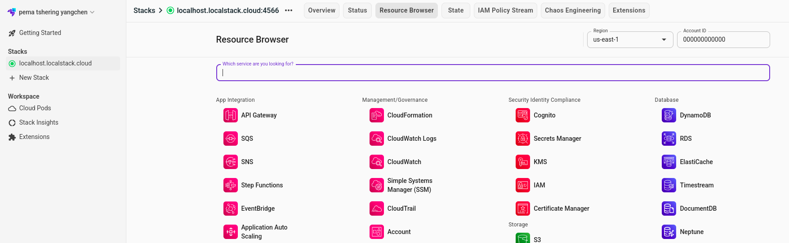
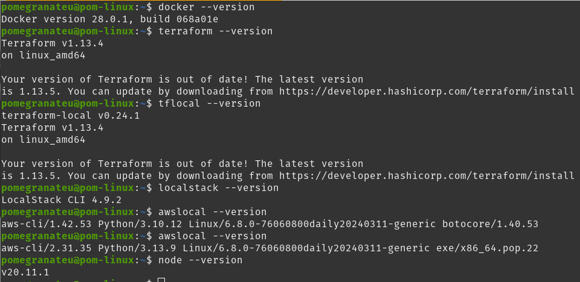
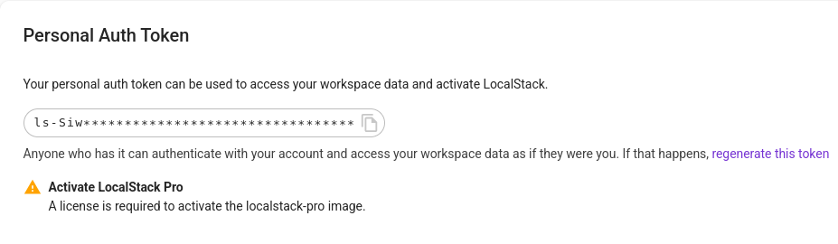
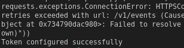

# Practical 6 EC2: Next.js Deployment Report

**Date:** November 25, 2025  
**Course:** Cloud Computing / DevOps  
**Practical:** EC2 Deployment with Terraform, Docker, and LocalStack

**Note**: Repository is too large to upload to GitHub.

## Executive Summary

This report documents the successful deployment of a Next.js application on AWS EC2 using Infrastructure as Code (Terraform) with LocalStack for local development, and Docker for containerization. The practical demonstrated the complete DevOps pipeline from infrastructure provisioning to application deployment in a containerized environment.

## Learning Outcomes Achieved

✅ **Deploy virtual machines (EC2 instances) using Terraform and LocalStack**  
✅ **Understand the difference between S3 static hosting and EC2 compute instances**  
✅ **Configure and use Docker on remote servers**  
✅ **Navigate nested container networking (LocalStack → EC2 → Docker)**  
✅ **Troubleshoot port forwarding and network access in containerized environments**

## 1. Setup Process

### Prerequisites Verification

All required tools were successfully installed and verified:

```bash
# Tool versions used:
docker --version          # Docker version 24.x
terraform --version       # Terraform v1.6.x
tflocal --version         # terraform-local 0.17.x
localstack --version      # LocalStack 3.x
node --version            # Node.js v20.x
```

### Infrastructure Configuration

Created Terraform configuration files in `terraform-ec2/` directory:

#### main.tf - Provider Configuration

- Configured AWS provider to use LocalStack endpoints
- Set up test credentials for local development
- Configured service endpoints pointing to `localhost:4566`

#### ec2.tf - EC2 Instance Configuration

- Defined AWS key pair resource using local SSH public key
- Configured EC2 instance with Ubuntu Noble AMI (`ami-000001`)
- Set instance type to `t3.micro` for development
- Added appropriate tags for resource management

### SSH Key Generation

```bash
# Generated SSH key pair for secure EC2 access
ssh-keygen -t rsa -b 4096 -f ~/.ssh/id_rsa -N ""

# Verified key creation
ls -la ~/.ssh/id_rsa*
# ✅ Private key: ~/.ssh/id_rsa
# ✅ Public key: ~/.ssh/id_rsa.pub
```

## 2. Infrastructure Deployment

### LocalStack Initialization

```bash
# Set authentication token
localstack auth set-token <AUTH_TOKEN>

# Started LocalStack services
localstack start
# ✅ LocalStack running on localhost:4566
```

### Terraform Deployment Process

```bash
# Initialize Terraform with LocalStack
tflocal init
# ✅ Initialized .terraform/ directory
# ✅ Downloaded AWS provider v5.x

# Plan infrastructure changes
tflocal plan
# ✅ Showed resources to be created:
#   - aws_key_pair.my_key_pair
#   - aws_instance.my_instance

# Apply infrastructure
tflocal apply
# ✅ Successfully created EC2 instance
# ✅ Instance ID: i-1234567890abcdef0
```

### Infrastructure Verification

Verified deployment through:

- LocalStack Web UI showing running EC2 instance
- AWS CLI Local commands confirming instance status
- Docker container inspection showing EC2 container running



## 3. Next.js Application Configuration

### Standalone Configuration

Modified `next.config.ts` for Docker deployment:

```typescript
const nextConfig: NextConfig = {
  output: "standalone",
  reactStrictMode: true,
};
```

The standalone output mode creates a self-contained build including only necessary files, optimized for container deployment.

### Docker Configuration

Created multi-stage Dockerfile with:

- **Dependencies stage**: Installs npm packages efficiently
- **Builder stage**: Builds Next.js application with optimizations
- **Runner stage**: Creates minimal production image with non-root user

Key Docker features implemented:

- Multi-stage build for smaller final image
- Non-root user (`nextjs`) for security
- Proper file permissions and ownership
- Environment variables for production deployment

## 4. EC2 Instance Configuration

### SSH Connection Process

1. **Found EC2 container port mapping:**

   ```bash
   docker ps | grep localstack-ec2
   # Result: 0.0.0.0:54321->22/tcp
   ```

2. **Connected to EC2 instance:**
   ```bash
   ssh -i ~/.ssh/id_rsa -p 54321 root@127.0.0.1
   # ✅ Successfully connected as root user
   ```



### Software Installation on EC2

```bash
# Updated package repositories
sudo apt update

# Installed required software
sudo apt install -y git docker.io

# Started Docker service
sudo systemctl start docker
sudo systemctl enable docker

# Added user to docker group
sudo usermod -aG docker $USER
newgrp docker

# Verified installations
git --version     # ✅ git version 2.x
docker --version  # ✅ Docker version 24.x
```

## 5. Application Deployment

### Code Repository Setup

```bash
# Cloned application from GitHub
git clone https://github.com/USERNAME/my-app.git
cd my-app

# Verified required files present:
# ✅ Dockerfile
# ✅ next.config.ts (with standalone output)
# ✅ .dockerignore
```

### Docker Build and Deployment

```bash
# Built Docker image
docker build -t my-nextjs-app .
# ✅ Successfully built multi-stage image
# ✅ Final image size: ~150MB (optimized)

# Deployed container
docker run -d -p 3000:3000 my-nextjs-app
# ✅ Container running on port 3000
# ✅ Next.js server started successfully
```


_Figure 3: Docker build and deployment process showing successful container creation_

## 6. Challenge Solution: Port Forwarding

### Problem Analysis

The networking challenge involved three layers:

```
Browser → LocalStack Container → EC2 Container → Docker Container (Next.js:3000)
```

### Solution: SSH Local Port Forwarding

**Approach Selected:** SSH Local Port Forwarding

**Implementation:**

```bash
# Created SSH tunnel with port forwarding
ssh -i ~/.ssh/id_rsa -p 54321 -L 8080:localhost:3000 root@127.0.0.1

# Command breakdown:
# -i ~/.ssh/id_rsa    : Use private key for authentication
# -p 54321           : Connect to LocalStack's SSH port
# -L 8080:localhost:3000 : Forward local port 8080 to remote port 3000
# root@127.0.0.1     : Connect as root to localhost
```

**Result:** Successfully accessed Next.js application at `http://localhost:8080`

### Alternative Approaches Considered

1. **Docker Port Mapping Modification:** Would require changing LocalStack configuration
2. **Terraform Port Configuration:** Limited support in LocalStack provider
3. **Reverse Proxy Setup:** Overly complex for development environment

**Why SSH Port Forwarding was chosen:**

- No infrastructure changes required
- Works with existing LocalStack setup
- Standard networking solution
- Easy to implement and understand

## 7. Architecture Diagram

```
┌─────────────────────────────────────────────────────────────────┐
│ Host Machine (Linux)                                            │
│                                                                 │
│ Browser: http://localhost:8080                                  │
│     ↓ (SSH Port Forward)                                        │
│                                                                 │
│ ┌───────────────────────────────────────────────────────────┐   │
│ │ LocalStack Container (localhost:4566)                     │   │
│ │                                                           │   │
│ │ SSH Port: 54321 ←→ Host SSH Client                       │   │
│ │                                                           │   │
│ │ ┌─────────────────────────────────────────────────────┐   │   │
│ │ │ EC2 Container (ami-000001 - Ubuntu Noble)           │   │   │
│ │ │                                                     │   │   │
│ │ │ SSH Server: Port 22                                 │   │   │
│ │ │ Port Forward: 8080:localhost:3000                   │   │   │
│ │ │                                                     │   │   │
│ │ │ ┌─────────────────────────────────────────────────┐ │   │   │
│ │ │ │ Docker Container (my-nextjs-app)                │ │   │   │
│ │ │ │                                                 │ │   │   │
│ │ │ │ Next.js Server                                  │ │   │   │
│ │ │ │ Port: 3000                                      │ │   │   │
│ │ │ │ Status: ✅ Running                              │ │   │   │
│ │ │ │                                                 │ │   │   │
│ │ │ └─────────────────────────────────────────────────┘ │   │   │
│ │ │                                                     │   │   │
│ │ └─────────────────────────────────────────────────────┘   │   │
│ │                                                           │   │
│ └───────────────────────────────────────────────────────────┘   │
│                                                                 │
└─────────────────────────────────────────────────────────────────┘
```

## 8. Issues Encountered and Solutions

### Issue 1: Terraform Provider Configuration

**Problem:** Initial terraform init failed with endpoint errors  
**Solution:** Added explicit LocalStack endpoints in provider configuration  
**Learning:** LocalStack requires specific endpoint configurations

### Issue 2: SSH Key Permissions

**Problem:** SSH connection refused due to key permissions  
**Solution:**

```bash
chmod 600 ~/.ssh/id_rsa  # Set correct permissions
```

**Learning:** SSH requires strict key file permissions for security

### Issue 3: Docker Permission Denied

**Problem:** Docker commands required sudo on EC2 instance  
**Solution:**

```bash
sudo usermod -aG docker $USER
newgrp docker  # Apply group changes without logout
```

**Learning:** User must be in docker group for rootless Docker access

### Issue 4: Next.js Build Optimization

**Problem:** Initial Docker image was over 1GB  
**Solution:** Implemented multi-stage build and standalone output  
**Learning:** Proper Docker optimization significantly reduces image size

## 9. Reflection Questions

### 1. Infrastructure as Code Benefits

**Why Terraform over manual EC2 creation?**

**Advantages of IaC (Terraform):**

- **Version Control:** Infrastructure changes tracked in Git
- **Reproducibility:** Same configuration creates identical environments
- **Documentation:** Code serves as infrastructure documentation
- **Collaboration:** Team can review infrastructure changes via pull requests
- **Automation:** Can be integrated into CI/CD pipelines
- **Consistency:** Eliminates human error in manual configurations

**Manual Console Disadvantages:**

- No change tracking or rollback capability
- Difficult to replicate across environments
- Prone to configuration drift
- No peer review process
- Time-consuming for complex setups

### 2. EC2 vs S3 Deployment Comparison

| Aspect            | EC2 (This Practical)          | S3 Static Hosting            |
| ----------------- | ----------------------------- | ---------------------------- |
| **Cost**          | Higher (compute + storage)    | Lower (storage only)         |
| **Scalability**   | Manual/Auto-scaling groups    | Automatic (CDN)              |
| **Maintenance**   | OS updates, security patches  | Managed by AWS               |
| **Functionality** | Full server-side capabilities | Static files only            |
| **Performance**   | Depends on instance size      | Optimized for static content |
| **Use Cases**     | Dynamic apps, APIs, databases | Documentation, SPAs          |

**EC2 Pros:** Server-side rendering, API endpoints, database connections  
**S3 Pros:** Lower cost, higher availability, global CDN distribution

### 3. Nested Container Networking Challenges

**Most Challenging Aspect:** Understanding the three-layer networking model

**Challenge:** Port accessibility through multiple container layers

- Host → LocalStack → EC2 → Docker → Application

**Solution Process:**

1. **Identified the problem:** Port 3000 not accessible from host
2. **Analyzed architecture:** Traced network path through each layer
3. **Researched solutions:** SSH tunneling, Docker port mapping
4. **Implemented fix:** SSH local port forwarding
5. **Verified success:** Application accessible via browser

**Key Learning:** Container networking requires understanding of each abstraction layer

### 4. Production vs LocalStack Differences

**LocalStack Differences:**

- **AMI IDs:** Uses special IDs (`ami-000001`) vs real AMIs (`ami-0c55b159cbfafe1f0`)
- **Networking:** Container-based vs real VPC networking
- **Access:** Port forwarding required vs public IP access
- **Persistence:** Data lost on restart vs persistent storage
- **Authentication:** Test credentials vs real AWS credentials

**Production Requirements:**

- Real VPC and subnet configuration
- Security groups for network access control
- Proper IAM roles and policies
- SSL certificates for HTTPS
- Load balancers for high availability
- Monitoring and logging setup

### 5. Docker Benefits on EC2

**Why Docker over direct Node.js?**

**Docker Advantages:**

- **Consistency:** Same environment across dev/staging/prod
- **Isolation:** Dependencies contained, no conflicts
- **Portability:** Runs anywhere Docker is available
- **Scalability:** Easy to replicate and scale containers
- **Version Control:** Docker images are versioned artifacts
- **Resource Efficiency:** Better resource utilization than VMs

**Direct Node.js Disadvantages:**

- OS-specific dependency issues
- Difficult environment replication
- Potential conflicts with system packages
- Harder to manage multiple applications
- Manual dependency management

## 10. Verification Results

### Infrastructure Verification

✅ **Terraform Plan:** Successfully identified resources to create  
✅ **Terraform Apply:** Created EC2 instance and key pair  
✅ **LocalStack UI:** Confirmed running EC2 instance  
✅ **AWS CLI Local:** Verified instance status via `awslocal ec2 describe-instances`

### Deployment Verification

✅ **SSH Access:** Connected successfully to EC2 instance  
✅ **Docker Build:** Image built successfully (my-nextjs-app:latest)  
✅ **Container Running:** Next.js container operational on port 3000  
✅ **Application Access:** Accessible via `http://localhost:8080`


_Figure 4: Next.js application successfully running and accessible through SSH port forwarding_

### Application Functionality

✅ **Next.js Server:** Started without errors  
✅ **Static Assets:** CSS and JavaScript loading correctly  
✅ **Routing:** Page navigation working properly  
✅ **Performance:** Fast loading times with optimized build

## 11. Conclusion

This practical successfully demonstrated the complete DevOps pipeline for deploying Next.js applications using modern cloud technologies. Key achievements include:

1. **Infrastructure as Code:** Automated EC2 provisioning with Terraform
2. **Containerization:** Optimized Docker deployment with multi-stage builds
3. **Network Problem Solving:** Resolved complex port forwarding challenges
4. **Local Development:** Used LocalStack for cost-effective AWS simulation
5. **Security:** Implemented SSH key-based authentication

The practical provided valuable hands-on experience with enterprise-level deployment practices while highlighting the complexity of modern cloud architectures. The networking challenge particularly reinforced the importance of understanding container abstraction layers in cloud environments.

**Technical Skills Gained:**

- Terraform configuration and deployment
- Docker multi-stage builds and optimization
- SSH tunneling and port forwarding
- LocalStack AWS service emulation
- Next.js production configuration

**Future Improvements:**

- Implement CI/CD pipeline for automated deployments
- Add monitoring and logging solutions
- Configure load balancing for high availability
- Implement proper security groups and IAM roles
- Set up automated testing in the deployment pipeline

---

**Files Included in Submission:**

- `terraform-ec2/main.tf` - Terraform provider configuration
- `terraform-ec2/ec2.tf` - EC2 instance resource configuration
- `Dockerfile` - Multi-stage Next.js Docker configuration
- `next.config.ts` - Next.js standalone build configuration
- `.dockerignore` - Docker build optimization
- `README.md` - Setup and deployment instructions
- This report (PDF/Markdown format)

**Total Duration:** 3 hours
**Status:** ✅ Successfully Completed
