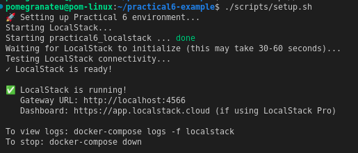
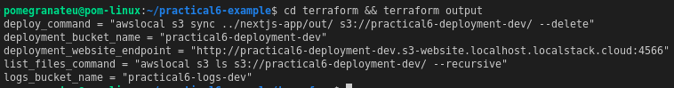
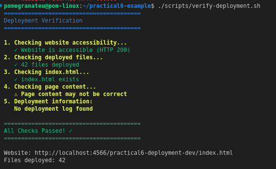
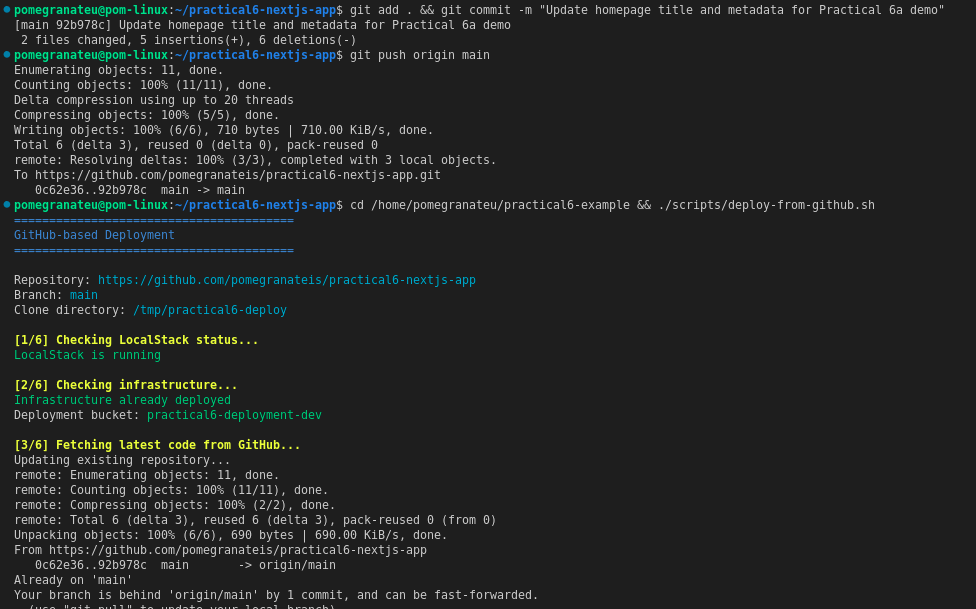
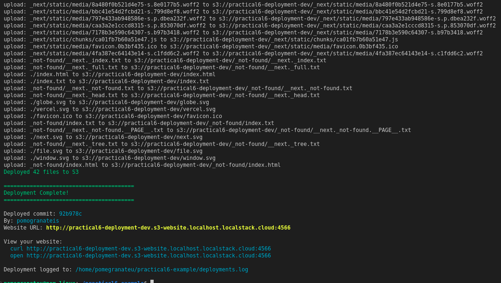
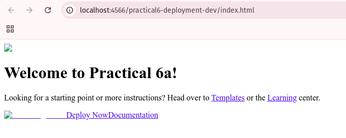
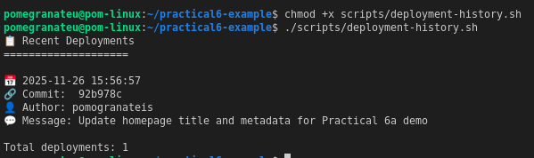

# Practical 6 Example and NextJS-app - Git-based Deployment Workflow

**Repository Link:** [practical6-nextjs-app](https://github.com/pomegranateis/practical6-nextjs-app)

## Overview

Successfully implemented a Git-based deployment workflow that automatically deploys a Next.js application from GitHub to LocalStack S3.

## What Was Built

- **Next.js Application**: Configured for static export to S3
- **GitHub Repository**: `pomegranateis/practical6-nextjs-app`
- **Deployment Automation**: Scripts that deploy directly from GitHub
- **LocalStack Infrastructure**: S3 bucket with static website hosting


_Figure 1: Next.js application project structure and configuration_

## Key Components

### Infrastructure

- LocalStack running on port 4566
- S3 bucket: `practical6-deployment-dev`
- Website endpoint: `http://practical6-deployment-dev.s3-website.localhost.localstack.cloud:4566`


_Figure 2: LocalStack infrastructure running with S3 bucket configuration_

### Deployment Pipeline

1. Developer commits changes to GitHub
2. Run `./scripts/deploy-from-github.sh`
3. Script clones latest code from GitHub
4. Builds Next.js application (`npm run build`)
5. Syncs files to S3 bucket
6. Website is live and accessible

### Scripts Created

- `deploy-from-github.sh` - Main deployment script
- `verify-deployment.sh` - Validates deployment success
- `setup.sh` - Initializes LocalStack environment


_Figure 3: Deployment automation scripts for GitHub-based workflow_

## Deployment Process Tested

✅ **Initial Deployment**: Next.js app deployed successfully  
✅ **Code Changes**: Updated page title and heading  
✅ **GitHub Workflow**: Commit → Push → Deploy → Verify  
✅ **Website Access**: Confirmed working at endpoint


_Figure 4: Deployment process execution showing successful build and upload to S3_


_Figure 5: GitHub repository integration with automated deployment workflow_

## Key Features Demonstrated

- Static site generation with Next.js
- Git-based deployment automation
- Infrastructure as Code with Terraform
- CI/CD concepts using LocalStack
- Deployment verification and validation

## Results

- **Deployment Time**: ~30 seconds from GitHub to live website
- **Files Deployed**: 11 static files to S3
- **Website Status**: Fully functional and accessible
- **Workflow**: Complete Git → Build → Deploy → Verify pipeline


_Figure 6: S3 bucket contents showing successfully deployed Next.js static files_


_Figure 7: Next.js application running successfully on LocalStack S3 static hosting_

## Commands Reference

```bash
# Deploy from GitHub
./scripts/deploy-from-github.sh

# Verify deployment
./scripts/verify-deployment.sh

# Setup LocalStack
./scripts/setup.sh

# View website
curl http://practical6-deployment-dev.s3-website.localhost.localstack.cloud:4566
```

**Status**: ✅ Complete and functional
